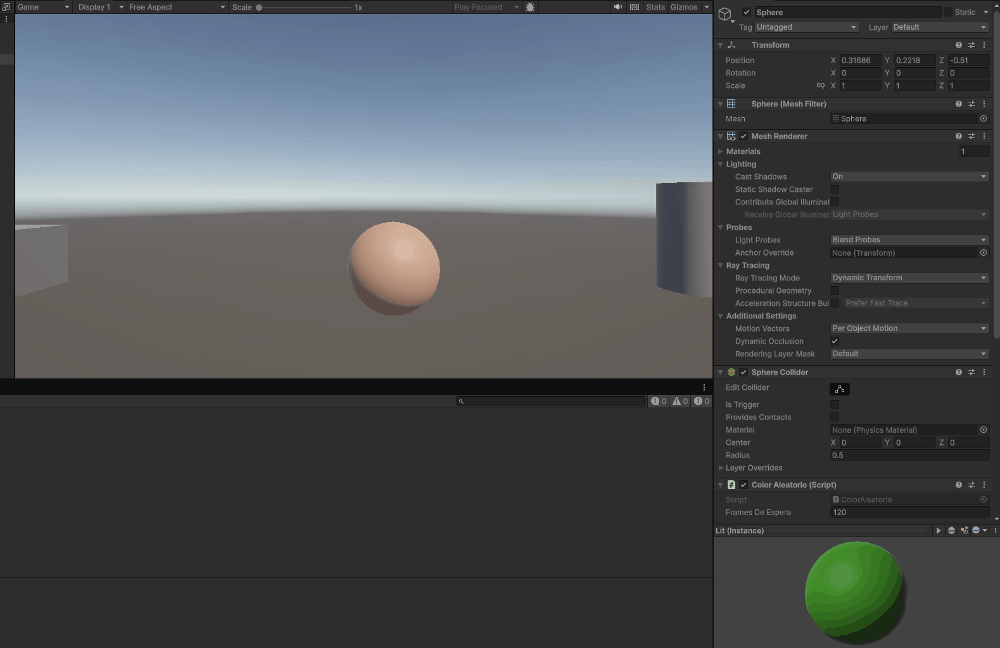
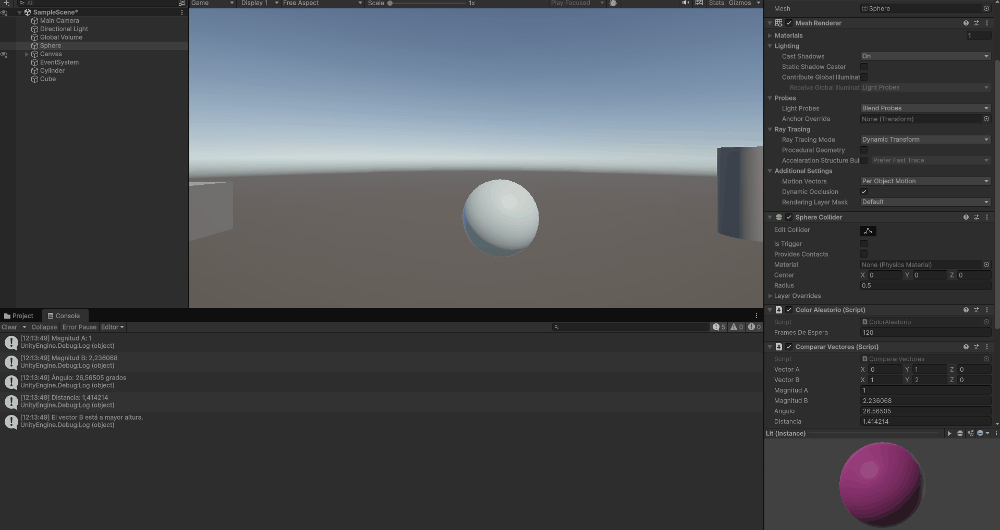
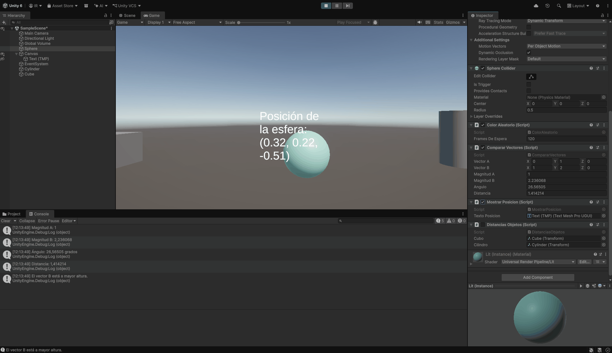
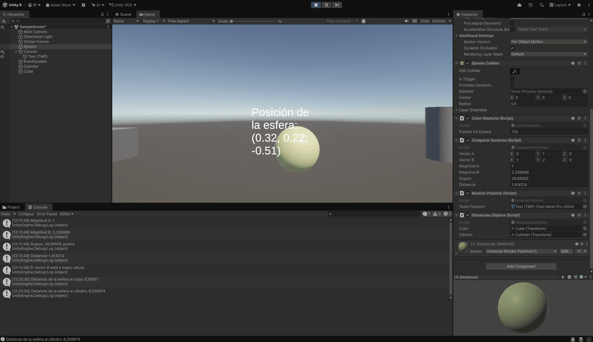

# Interfaces Inteligentes: introducción a scripts en Unity

Proyecto de Unity 6 con los ejercicios de scripts y movimiento realizados en una escena 3D.

## Requisitos y ejecución

1. Abrir la carpeta del proyecto desde Unity Hub con Unity 6.
2. Abrir `Assets/Scenes/SampleScene.unity`.
3. Pulsar **Play**. Consultar **Game** para los cambios visuales y **Console** para los cálculos.

## Hitos de la práctica

| Ejercicio | Script | Resultado |
| --- | --- | --- |
| 1. Color aleatorio | `ColorAleatorio.cs` | La esfera cambia de color tras el número de fotogramas indicado en el Inspector (120 inicialmente). |
| 2. Comparación de vectores | `CompararVectores.cs` | Muestra en Console las magnitudes, el ángulo, la distancia y el vector de mayor altura; los valores calculados aparecen también en el Inspector durante Play. |
| 3. Posición en pantalla | `MostrarPosicion.cs` | Un texto TextMeshPro en el Canvas muestra la posición de la esfera. |
| 4. Distancias a objetos | `DistanciasObjetos.cs` | Muestra en Console las distancias de la esfera al cubo y al cilindro. |

Los scripts están asociados a la esfera. Las referencias al cubo, al cilindro y al texto TextMeshPro se asignan en el Inspector de la escena.

## Pruebas de ejecución

> Pendiente: grabar los siguientes GIF desde la pestaña **Game** o **Console** de Unity y guardarlos en `docs/gifs/` con estos nombres. Las imágenes de abajo aparecerán automáticamente cuando esos archivos se añadan al repositorio.

### 1. Cambio de color

### 2. Comparación de vectores

### 3. Posición de la esfera

### 4. Distancias al cubo y al cilindro

## Notas de comprobación

- Para el ejercicio 1, comprobar que el color cambia mientras el juego está en marcha y que `Frames De Espera` puede modificarse desde el Inspector.
- Para el ejercicio 2, cambiar los componentes de los vectores en el Inspector y volver a pulsar Play para obtener nuevos resultados.
- Para el ejercicio 3, modificar `Transform > Position` de la esfera fuera de Play y comprobar el texto al iniciar de nuevo.
- Para el ejercicio 4, colocar el cubo y el cilindro en posiciones distintas y comprobar las dos salidas en Console.
